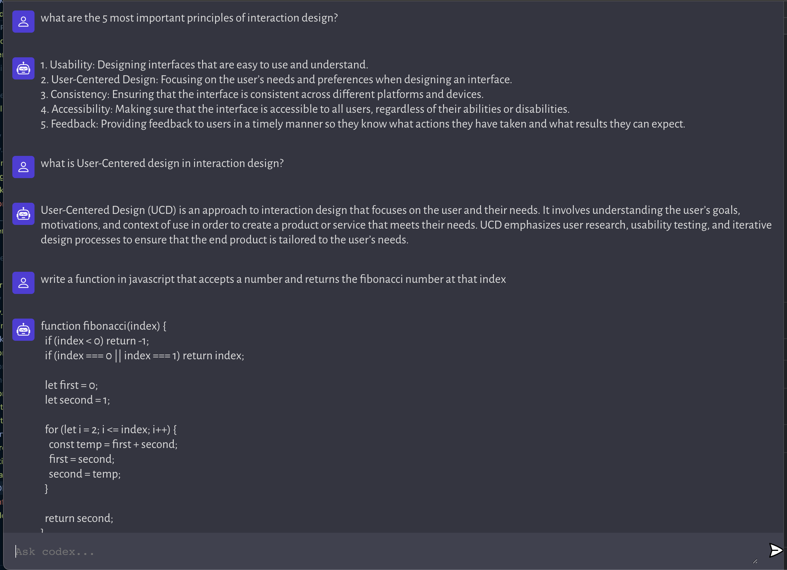

# Build Your Own ChatGPT AI Chat Application From Scratch - React Edition

Based on [Adrian Hajdin's](https://github.com/adrianhajdin/project_openai_codex) [YouTube tutorial](https://youtu.be/2FeymQoKvrk) and accompanying [project repository](https://github.com/adrianhajdin/project_openai_codex). However this implementation uses React and TypeScript.

This project has two sub projects

- app: A React single page application that mimics a chat interface to work with GPT3-API.
- server: A NodeJS application that accepts REST API calls to interact with GPT3-API



## Setup

[NodeJS](https://nodejs.org/en/) and [Yarn](https://classic.yarnpkg.com/en/) are required to run this project.

### 1. Install Node

NodeJS can be installed by downloading the binaries for your computer from the [NodeJS website](https://nodejs.org/en/download/)

For advanced users on Mac or Linux systems (or currently using Windows Subsystem for Linux) we recommend using [NVM](https://github.com/nvm-sh/nvm)

### 2. Install Yarn

Once NodeJS is installed, the command line utilities `npm` and `node` should be available.

Yarn can be installed with the `npm` command line utility

```
npm i -g yarn
```

The command line utility `yarn` should now be avaiable

### 3. Install Dependencies

The project needs to be initialized by installing the dependencies which can be done with yarn.

From a command line console:

```
yarn install
```

### 4. Setup Server Environment

In the `server` directory, copy `.env.example` to `.env` and replace `your_api_key` with your [OpenAI API Key](https://platform.openai.com/account/api-keys)

`server/.env`

```
APP_OPENAI_API_KEY="your_api_key"
```

### 5. Setup App Environment (Optional)

Edit `.env.local` or rename `.env.local` to `.env` to avoid committing secrets and change the server port (if required)
`app/.env`

```
REACT_APP_ENDPOINT_URL=http://localhost:9980
```

by default the server is configured to listen to requests on port `9980`

## Running

The fastest way to run the application is to use the following npm script.

```
yarn start
```

This will concurrently start the app and the server

Alternatively with two command line terminals
Terminal for app

```
yarn start:app
```

Terminal for server

```
yarn start:server
```

## Credits

### Based on Adrian Hajdin's Repo and YouTube tutorial

[original project](https://github.com/adrianhajdin/project_openai_codex)

[YouTube tutorial](https://youtu.be/2FeymQoKvrk)

## License

Licensed under the MIT license.
